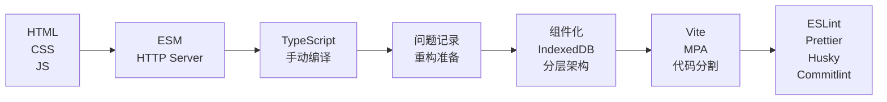

# 🏗️ 工程化里程碑 (Engineering Milestones)

本文档详细记录项目从零开始逐步建立现代化前端工程体系的完整里程碑。

## 📊 里程碑总览

| 阶段        | 核心成就           | 技术栈状态                  | 文档链接                                                                                                                                                  |
| ----------- | ------------------ | --------------------------- | --------------------------------------------------------------------------------------------------------------------------------------------------------- |
| **Stage 1** | 原生开发起步       | HTML + CSS + JS             | [决策文档](./docs/decisions/001-initial-setup.md) [心路历程](./docs/innerOS/001-initial-setup.md)                                                      |
| **Stage 2** | ESM模块化          | HTTP Server + 原生ESM       | [决策文档](./docs/decisions/002-native-esm-and-local-server.md) [心路历程](./docs/innerOS/002-why-modules-and-server.md)                               |
| **Stage 3** | TypeScript类型系统 | TS编译 + 手动构建           | [决策文档](./docs/decisions/003-adopt-typescript-without-bundling.md) [心路历程](./docs/innerOS/003-type-anxiety-vs-bundler-temptation.md)             |
| **Stage 4** | 重构准备           | 问题代码记录                | [决策文档](./docs/decisions/004-problem-code-stage.md) [心路历程](./docs/innerOS/004-problem-code-stage.md)                                            |
| **Stage 5** | 现代化架构重构     | 组件化 + 数据持久化         | [决策文档](./docs/decisions/005-architecture-refactor-and-feature-expansion.md) [心路历程](./docs/innerOS/005-architecture-refactor-pain-and-gains.md) |
| **Stage 6** | 现代构建工具链     | Vite + MPA + 代码分割       | [决策文档](./docs/decisions/006-modern-build-architecture.md) [心路历程](./docs/innerOS/006-growing-pains-and-toolchains.md)                           |
| **Stage 7** | 代码质量标准化     | ESLint + Prettier + Git钩子 | [决策文档](./docs/decisions/007-quality-and-standardization.md) [心路历程](./docs/innerOS/007-law-and-order.md)                                        |

## 🎯 各阶段详细说明

### Stage 1: 原生开发起步 🏃‍♂️

**时间节点**: 项目启动初期
**核心哲学**: Keep It Stupid Simple
**技术成就**:

- ✅ 纯原生技术栈 (Vanilla Stack)
- ✅ 双击运行，无需构建
- ✅ 零依赖开发

**关键决策**:

- 选择原生技术栈，避免过早复杂化
- 数据硬编码，专注功能验证
- 简单目录结构，快速启动

### Stage 2: ESM模块化觉醒 📦

**时间节点**: 代码量突破舒适区
**核心哲学**: 所写即所跑，但需要组织
**技术成就**:

- ✅ 原生ESM支持 (`<script type="module">`)
- ✅ HTTP服务器替代file://协议
- ✅ 按职责拆分文件 (main.js, data.js, render.js)

**关键决策**:

- 保持零构建，浏览器直接执行
- 仅引入开发时HTTP服务器
- 模块化但不打包

### Stage 3: TypeScript类型觉醒 🔒

**时间节点**: 重构恐惧出现
**核心哲学**: 运行时报错太慢，要在保存时就报错
**技术成就**:

- ✅ TypeScript编译器集成
- ✅ `.ts` 到 `.js` 的1:1映射
- ✅ IDE智能提示和重构支持

**关键决策**:

- 坚持零打包，保持源码透明
- 手动编译，观察构建产物
- 必须写`.js`后缀的妥协

### Stage 4: 问题代码蓄意记录 📝

**时间节点**: TypeScript引入后复杂度激增
**核心哲学**: 故意保留问题，作为重构时机证据
**技术成就**:

- ✅ 问题代码系统性记录
- ✅ Git提交作为问题存档
- ✅ 重构必要性量化

**关键决策**:

- 不立即修复问题，而是记录
- 通过问题积累证明重构价值
- 为后续重构建立基线

### Stage 5: 现代化架构重构 🏗️

**时间节点**: 代码失控，功能需求爆发
**核心哲学**: 与其挣扎，不如重建
**技术成就**:

- ✅ 页面化架构 (MPA)
- ✅ 组件化开发 (JS生成DOM)
- ✅ 分层架构 (表现/组件/业务/数据)
- ✅ IndexedDB数据持久化
- ✅ Word文档导出功能

**关键决策**:

- 一次性大重构而非渐进式
- JS生成DOM而非Template/Web Components
- IndexedDB而非传统数据库

### Stage 6: 现代构建工具链 ⚡

**时间节点**: 模块化拆分导致性能问题
**核心哲学**: 开发时的离散与运行时的聚合
**技术成就**:

- ✅ Vite构建工具 (Dev/Prod双模式)
- ✅ MPA多页应用配置
- ✅ 代码分割和缓存优化
- ✅ 依赖管理标准化 (NPM)
- ✅ 自动化迁移脚本

**关键决策**:

- Vite而非Webpack (开发体验优先)
- 按页面分割而非过度模块拆分
- 第三方库独立打包
- `.mts`严格ESM规范

### Stage 7: 代码质量标准化 ⚖️

**时间节点**: 工具链完善，质量管控缺失
**核心哲学**: 秩序不再是负担，而是效率的基石
**技术成就**:

- ✅ ESLint v9 Flat Config
- ✅ Prettier自动格式化
- ✅ Husky Git钩子自动化
- ✅ Commitlint提交规范
- ✅ 类型系统完善 (any类型消除)

**关键决策**:

- 可执行的代码规范而非文档
- 自动化执法而非人工检查
- 渐进式严格 (warn到error)
- 配置文件类型化

## 📈 技术栈演进图

## 🎖️ 核心成就统计

### 技术指标

- **构建时间**: 从手动复制 → 自动化构建 (Vite)
- **代码质量**: 从无检查 → 全自动化管控
- **类型安全**: 从纯JS → 严格TypeScript
- **开发体验**: 从手动刷新 → 热重载
- **团队协作**: 从个人开发 → 标准化工作流

### 架构演进

- **从单文件** → **模块化** → **组件化** → **分层架构**
- **从手动管理** → **NPM生态** → **自动化工具链**
- **从个人项目** → **企业级工程体系**

### 思维转变

- **从功能导向** → **工程思维**
- **从写代码** → **建体系**
- **从解决问题** → **防问题**

## 🚀 启示与经验

### 按需搭建的核心原则

1. **问题驱动**: 只有真实痛点出现时才引入复杂度
2. **渐进式**: 从简单开始，逐步优化到最佳状态
3. **可持续**: 建立完整的维护体系而非一次性解决方案

### 架构师的成长路径

1. **功能实现者** (Stage 1-2): 专注业务代码
2. **工具选择者** (Stage 3-4): 学习技术选型
3. **系统构建者** (Stage 5-7): 建立工程体系

### 项目成功的关键因素

- **文档化**: 每个决策都有记录和理由
- **可观测性**: 性能指标和质量度量
- **自动化**: 工具链而非人力依赖
- **标准化**: 一致的开发体验

这个工程化里程碑不仅记录了技术栈的演进，更体现了**从零到一构建现代化前端项目的完整方法论**。每一步都有明确的需求驱动，每一个决策都有详细的记录和反思。

---

_最后更新: 2024年项目Stage 7完成时_
